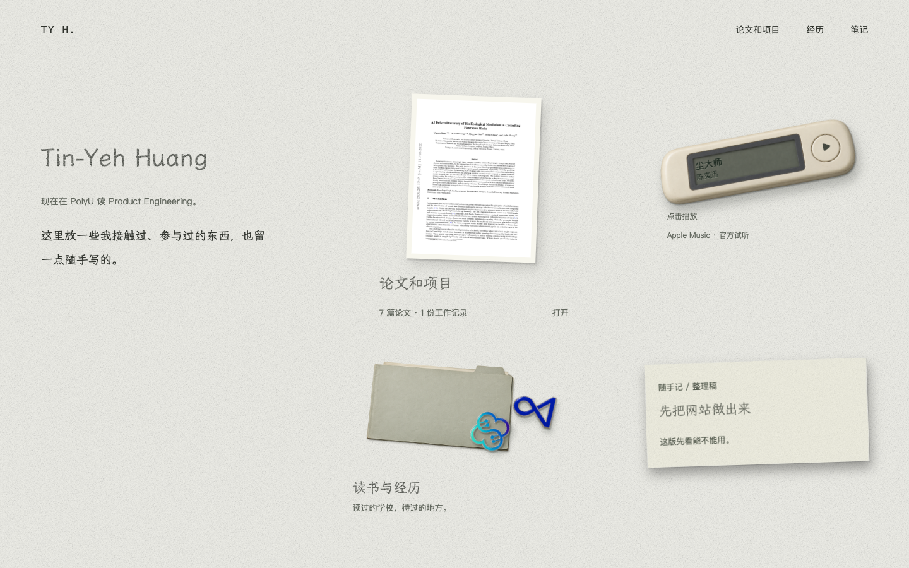
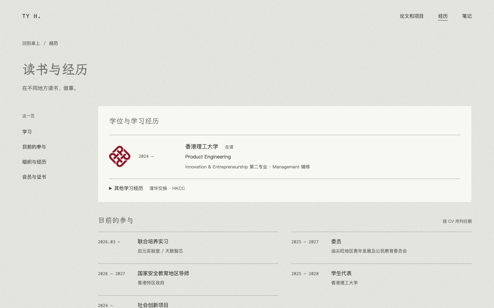
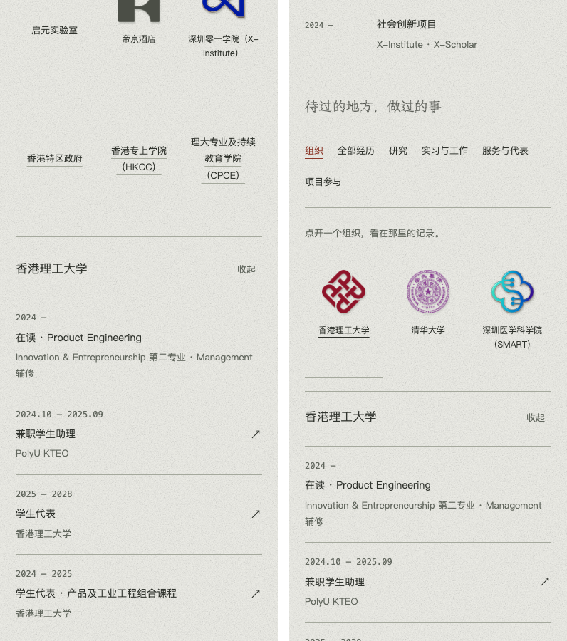
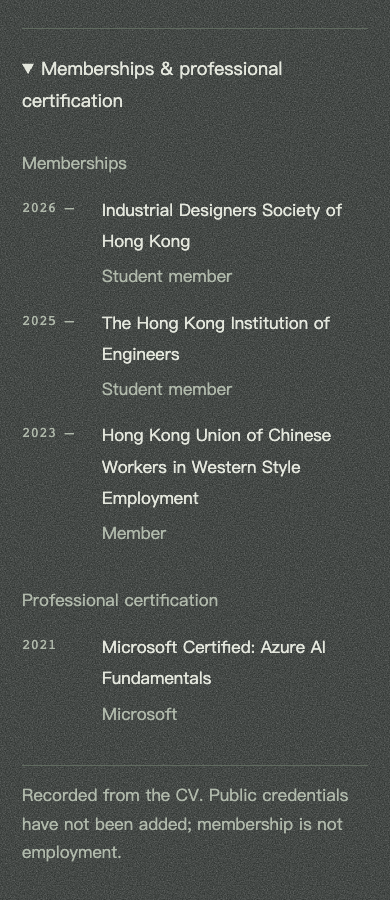

# 個人網站：這輪設計判斷與修改

日期：2026-09-14。審查從 09-12 的工作延續；截圖沿用 `design-audit-2026-09-12/` 資料夾，`before` 是本輪修改前，`final` 是目前實作。這不是全站定稿或身分核驗報告。

## 結論

保留工作桌，不把所有內容擠成首頁上的物件。首頁負責讓人認識你、選擇要翻開什麼；內頁負責查找和閱讀。物件不必每一件都是一種新功能，文字索引也不需要做成另一件擬物裝飾。

## 01 · 首頁：方向保留，內容尚未完整

姓名和簡介先於經歷成立；紙張、音樂裝置與徽章有不同的功能。新增一個 ImageGen 生成的薄紙檔案夾，和既有兩枚徽章共用「讀書與經歷」入口，沒有再創造一份資料。它表示收納，不表示第三所學校或新的身分。保留原材質參數、字體與音樂行為。

視覺判斷：檔案夾讓兩枚徽章有共同的歸屬，但入口仍只是一個組合；沒有把它放大成新的主視覺。首頁留白是既有方向，不因為可以加東西就填滿。

尚未解決：兩篇筆記、近況和圖集主要描述網站製作，本人內容仍少。生成材質图不是你的攝影或作品；目前明示其來源。下一輪應補可公開的真實內容，不應由助手杜撰個人故事。沒有替你添加私人聊天、肖像或聯絡資料。

## 02 · 經歷概覽：層級已改善

先呈現目前在讀；清華交換、HKCC 學習可展開，摘要仍能看到兩者名稱。五段目前參與沒有被刪掉，也沒有一概稱作就業。

左邊增加頁內索引：學習／目前的參與／組織與經歷／會員與證書。它定位到現有內容，不建立新頁或複製資料。手機上變為普通內容流裡的文字索引，不黏住螢幕。分類篩選移到記錄區上方，避免兩個側欄競爭。

取捨：手機多了一小段索引，而不是純粹縮短頁面；價值在於讀者可直接找到證書或組織，不必先讀完全部任期。這是設計判斷，尚未以訪客研究驗證。

## 03 · 點開組織：原入口不再消失

修改前，在同一個 390 × 900 視窗點理大，頁面從 scrollY 1214 跳到 1983；原按鈕移到視窗頂部上方約 400px。原因是所有組織共用的內容區放在整個徽章陣列之後。

目前在選中徽章所在列後面展開，視窗縮放時重新判斷列尾。相同測試下點選前後 scrollY 都是 1121，徽章和記錄開頭能同時看見。展開後縮放保留鍵盤焦點；關閉返回原徽章。沒有用模糊、轉盤或動畫掩蓋資訊。

剩餘限制：只有兩枚徽章是生成的立體素材，其餘是原標誌或純文字。這種完成度差異仍在；不聲稱已完成全套材質與物理建模。

## 04 · 會員與憑證：分類清楚，真實核驗仍待補

三項會員與一項專業證書分組。資料模型分開 `kind`、頒發／所屬機構和公開憑證。現有資料均來自 CV，尚沒有個人公開凭證網址；不以機構首頁、logo 或裝飾勾號冒充核驗。

之後可以放官方個人名錄、可公開的委任記錄、頒發者的證書驗證頁；通用組織介紹頁只能算背景連結，不能證明本人身分。證書掃描需先遮掉不宜公開的編號、簽名或聯絡資料。

## 下一步的資料結構，而非更多頁面形式

- 組織是查找入口；一個組織可關聯多段經歷，聯合主辦可指向同一段記錄。
- 任期／角色描述「何時以什麼身分參與」，與會員、證書分開。
- 作品頁保留論文、程式碼、版本及外部來源；個人經歷頁連到自己參與的工作。
- 個人文字屬於「我的記錄」，外部資料屬於「來源」。二者同頁共存，但不互相冒充。
- 後續新增條目先進內頁。只有現有閱讀方式確實不適合新內容，才加新形式。

## 驗證範圍與限制

以獨立 Chromium 實際操作並檢視截圖，非使用者瀏覽器資料。此輪針對索引落點、展開列位置、焦點與縮放增加 12 項測試；組織既有 19 項測試通過。靜態資料檢查為 158 項。最後完整回歸結果另見 `design-qa.md`。

已檢查 360–1440px 的展開位置，並檢視手機深色、英文、130% 文字。截圖曾有一張因懶載入而空白的材質照片，已拒收並在載入完成後重拍，沒有用空白畫面作通過證據。

沒有做真人訪客測試、完整無障礙認證、Safari／iOS／折疊手機實機測試，也没有完成學歷、任命與會員的獨立核驗。功能測試通過不等於設計定稿。

## 素材與可調設定

- 新素材：`dist/desk-assets/study-folder-v1.png`，內建 ImageGen 生成，保留真實 alpha 透明背景。
- 選用設定：`dist/desk-config.mjs` 的 `experienceFolder`；設為空字串可移除檔案夾，原徽章素材不受影響。
- 生成指令：[FOLDER-PROMPT.md](FOLDER-PROMPT.md)。
